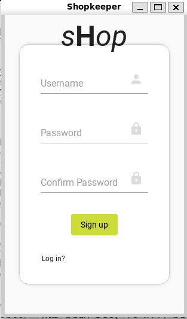
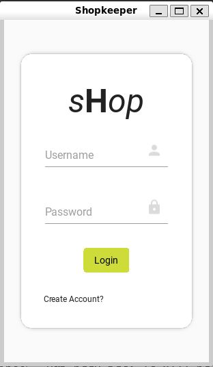
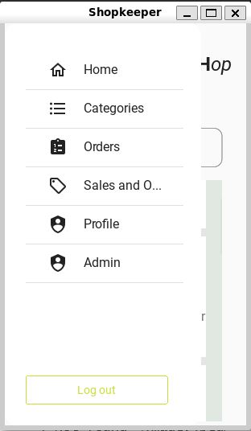
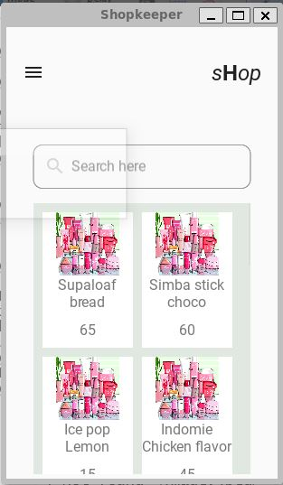

# Shopkeepers

*Developed by Ibrahim Kimotho*

## It's a helper app for vendors who already have a physical shop - to expand their horizon beyond the limits

_____
### Architecture
The app in made with KivyMD/Kivy and stores access token in sqlite3 within the users app.

The backend *Flask API* is served on a linux server with ufw firewalling, nginx reverse proxy and talking to a mysql database

#### The Back-end API
Create an account to be furnished with an access token that you'll need for all other endpoints.
Supply the AUTHORIZATION header with every request, "AUTHORIZATION": BEARER <acces-token>

*The end-points:*
- /create_ac - create a new user
- /products - retrieve all products
- /upload - for photo uploads
- /login - validate registerd users
- /refresh - renew expired access token
- /create_item upload new stock item

### SETUP
1. Clone this repo into your directory of choice `git clone https://github.com/KimothoIbrahim/Shopkeepers.git`
2. To install, first get the dependencies by running `pip install -r requirments.txt`
3. run the server `python3 server.py`
4. Run the Kivy app `python3 main.py`

### Screenshots

